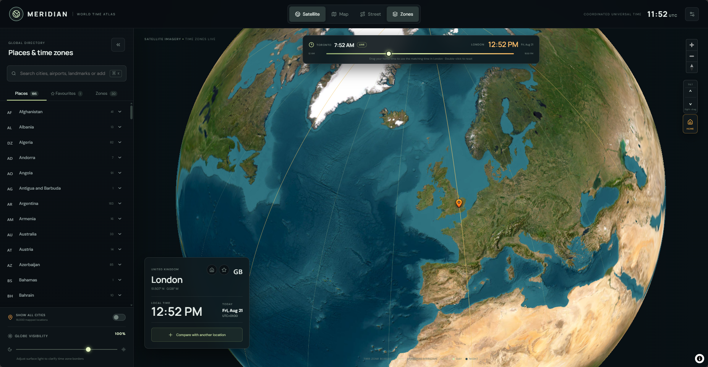

# Meridian — World Time Atlas

Meridian is an interactive world-time and trip-planning atlas. It combines satellite, map, and street views with live local times, time-zone comparisons, location search, saved places, and approximate travel estimates.



## Features

- **Interactive world map** with satellite, topographic, and street views
- **Live local time** for more than 16,000 mapped cities
- **Time-zone overlays** and standard meridian lines
- **Time comparison slider** for finding the corresponding time and date in another location
- **Place search** for cities, airports, landmarks, postcodes, and street addresses using OpenStreetMap data
- **Location comparison** with time-difference calculations
- **Home location** detection and quick navigation
- **Saved locations** with custom aliases and searchable tags
- **Map context actions** for pinning arbitrary coordinates or defining a trip
- **Trip estimates** for driving, walking, cycling, public transit, direct flights, and connecting-flight itineraries
- **Map controls** for city visibility, brightness, zoom, and tilt

## Flight estimates

Flight times are approximate rather than live itinerary data. The model uses:

- An average commercial flight speed of **820 km/h**
- **35 minutes** of overhead per flight segment
- A distance-based estimate of the number of connections
- An average **2-hour layover** per connection

Actual flight duration depends on available routes, aircraft, weather, airport congestion, and airline schedules.

## Technology

- React and TypeScript
- Vite
- MapLibre GL
- Leaflet and React Leaflet
- Three.js
- OpenStreetMap/Photon geocoding
- `tz-lookup` and browser internationalization APIs
- Nginx and Docker Compose for production hosting

## Run locally

### Requirements

- Node.js 22 or newer
- npm

### Development server

```bash
npm install
npm run dev
```

Open the URL displayed by Vite, normally <http://localhost:5173>.

### Production build

```bash
npm run build
npm run lint
```

The optimized application is generated in `dist/`.

## Run with Docker

The Compose configuration attaches the application to an external Docker network named `cloudflare_gateway`. Create it once if it does not already exist:

```bash
docker network create cloudflare_gateway
```

Build and start the application:

```bash
docker compose up -d --build
```

The default address is <http://localhost:18080>.

Use a different host port by setting `APP_PORT`:

```bash
APP_PORT=8080 docker compose up -d --build
```

On PowerShell:

```powershell
$env:APP_PORT = 8080
docker compose up -d --build
```

Check container health with:

```bash
docker compose ps
```

## City data

The generated city and country datasets are stored in:

- `src/cities.generated.json`
- `src/countries.generated.json`

Regenerate them with:

```bash
npm run generate:cities
```

## Browser permissions and storage

Geolocation is optional and is used only when detecting a home location. Home, favorite, alias, and tag settings are retained in browser `localStorage`. Search requests are sent to the configured OpenStreetMap-based Photon geocoding service.

## Project structure

```text
src/
  App.tsx             Main interface and application state
  WorldMap.tsx        MapLibre world map
  StreetMap.tsx       Leaflet street-detail map
  Globe.tsx           Three.js globe implementation
  geocoding.ts        Place and address lookup
  data.ts             City/time-zone data helpers
  styles.css          Application styling
public/assets/         Static map assets
scripts/               City-data generation scripts
Dockerfile             Multi-stage production image
docker-compose.yml     Container configuration
nginx.conf             Production web-server configuration
```
